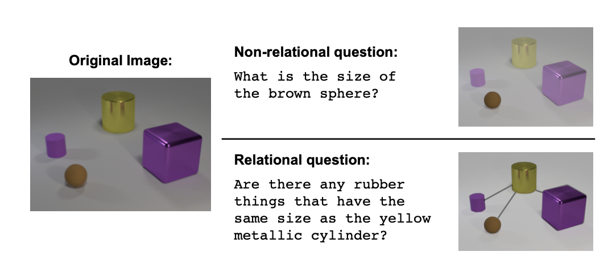
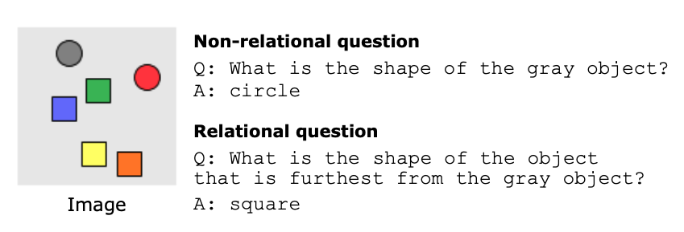
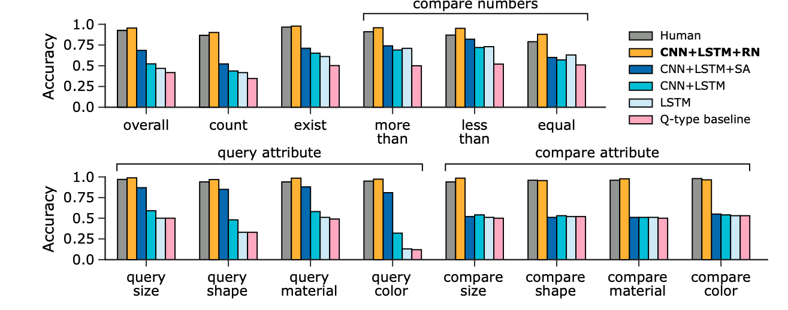

# A simple neural network module for relational reasoning

## Basic Information

| 引用情報 |                                                                                                                        |
| -------- | ---------------------------------------------------------------------------------------------------------------------- |
| 筆者     | Adam Ssantoro, David Raposo, David G.T. Barret, Mateusz Malinowski, Razvan Pascanu, Peter Battaglia, Timothy Lillicrap |
| 所属     | Deepmind                                                                                                               |
| 会議     | NIPS                                                                                                                   |
| 年       | 2017                                                                                                                   |
| 引用数   | 591                                                                                                                    |
| リンク   | https://papers.nips.cc/paper/7082-a-simple-neural-network-module-for-relational-reasoning                              |

## どんなもの

Relational reasoning (関係推論)は通常のNeural Networksでは学習が難しい。筆者らが提案するRelation Networks(RNs)はrelational reasoningを解くことができるplug-and-playなモジュールである。筆者らはRNsを組み込んだネットワークでVisual QA(CLEVR)において人間を超える性能を達成した他、テキストベースのQA(bAbI)および動的な物理系に関する複雑な推論タスクを試している。また、Sort-of-CLEVRと呼ばれるデータセットを作成し、強力なCNNでも関係推論は行えないことを示した上でRNsを組み込むことで扱えるようになることを示した。

## 先行研究に比べてどこがすごい

関係推論は日常的に発生するタスクである。例えば、ミステリー小説を読む人は各証拠をグローバルなコンテキストの中でミステリーを解くための答えと関係付けなければならない。
Symbolic AIは本来的にrelationalであり、これらのrelationを論理などで表現し、関係を推論や代数的なアプローチで求めようとしたが、symbol grounding problemが解決できなかった。一方、統計的学習では生のデータから汎化する表現を作ることができる(symbol grounding problemを解決できそう)が、隠されている構造が複雑な関係に特徴付けられていながらデータがスパースであるときなどにうまくいかなくなる。

Relation Networksは関係推論に明示的にフォーカスしたアーキテクチャである一方で、同様の目的のアーキテクチャであるGraph Neural NetworksやGated Graph Sequence Neural Networks, Interaction Networksと比べてシンプルで、plug-and-playである。さらに、joint trainingを通して、RNは上流のCNNやLSTMなどにrelational reasoningの役に立つobject-likeな表現を生み出させることができる。

筆者らはCLEVRと呼ばれるVisual QAのデータセットで人間を超えるスコアを出した他、テキストベースのQAでも非常に良い成績を出している。

## 技術や手法のキモはどこ

Relation Networksはネットワークのアーキテクチャを以下の形に限定する(最もシンプルな場合)。

```{latex}
\mathrm{RN}(O) = f_\phi\left(\sum_{i, j}g_\theta(o_i, o_j)\right)
```

入力は"objects"の集合であり`$O = \{o_1, o_2, \cdots, o_n\}, o_i\in \mathcal{R}_m$`である。また、`$f_\phi, g_\theta$`はパラメータ`$\phi, \theta$`の関数であり、今回はMLPで表現されている。特に`$g_\theta$`は"relation"と呼ばれ、二つの物体がどう関連しているかを推論するものである。RNsは

* relationを推論するように学習する
* データ効率がいい
* 物体の集合に対して適用できるため、汎化する。

の三つの性質をもつ。

### RNsはrelationを推論するように学習する

RNsの関数の表現形式は全ての物体の間の関係を考えるようになっている。したがって、関係が存在しない場合にも関係が存在しない、と推論するようになっている他、関係の種類も推論する

### RNsはデータ効率がいい

ここの関係を計算するのが単一の関数`$g_\theta$`なので特定の物体ペアにのみ現れる特徴に依存せず汎化する。これを各物体を一つの特徴として扱うようなMLPとして設計すると異なる物体ペアごとにn^2の関係を表現する関数を作ることに相当し、データ効率の観点からは悪い

### RNsは物体の集合において動作する

RNsの定義により、RNsは物体の順序に対して不変である。これは、集合の性質である順不変性に対応している。

## どうやって有効だと検証した

### CLEVR



入力は画像と言語の両方であり非常に難しいタスクである。しかし、多くのvisual QAのデータセットに比べれば、指定された語彙がない場合に単語の推論が必要だったり、世界に関する莫大な知識を必要とするためそれと比べると扱いやすいデータセットである。この論文の登場前の最高精度は68.5%であり、人間の92.6%には遠く及ばなかった他、`compare attribute`や`count`など複数の物体の関係を捉える必要があるquestionに対してはランダムより少しいい程度の性能しか出ていなかった。

この論文では、二つのCLEVRデータセットを用いた

1. pixelバージョン、すなわち画像が普通の2Dのpixelで表現されているもの
2. state descriptionバージョン、すなわち画像は三次元の座標(x, y, z), 色(r, g, b), 形(cube, cylinder, etc...), 材質(rubber, metal, etc...), size(small, large, etc...)などの記述によって表されているバージョンである。

### Sort-of-CLEVR



CLEVRデータセットを模して筆者らが作ったデータセット。このデータセットはrelationalな質問とnon-relationalな質問を区別している。
Sort-of-CLEVRデータセットは、二次元の画像のなかに色付きの物体がありそれらに関する質問と答えが用意されているものである。各画像は全部で6の物体が含まれており、それぞれの物体はランダムに選ばれた形状をしている。
質問文は自然言語ではなく、固定長のバイナリの形式で与えられ(問題を簡単にするため)、各画像につき、10個のrelationalな質問とnon-relationalな質問が用意されている。

### bAbO

テキストベースのQAデータセット。20のタスクがあり、それぞれが特定のreasoning(帰納・演繹・数え上げなど)に対応している。例えば、"Sandora picked up the football.", 'Sandora went to the office"という文があり、質問が"Where is the football?"なときに答えが"office"といった形である。このタスクにおいてはmemory-augmentedなネットワークが非常に良い結果をあげている。

### Dynamic physical systems

MuJoCo上でバネマス系の物理シミュレーションデータを作成した。10個の色付きのボールがテーブル上においてあり、いくつかはランダムに自由に動いていてボール間や壁とぶつかったりする一方で、その他は不可視のバネか剛体の棒で繋がれているとする。モデルへの入力は各自国におけるボールの位置を示した時系列の画像入力である。これに対し二つのタスクを定義した

1. 複数のフレーム列の中で色と座標のみを観測している場合にボール間にコネクション(バネや剛体制約)が働いているかどうかを推論する
2. 1.と同じ条件においてボール間にコネクションが働いている系の数を当てる。

### Model

CNNやLSTMの埋め込み表現とRNを繋ぐやり方について。RNは入力として物体っぽいものの表現を与える必要があるが、何がobjectかという意味上の定義は与える必要がない。学習の過程で、有用な"物体"が分散表現の中から勝手に学習される。

#### Pixelデータ

128 x 128の画像を受け取り、4回の畳み込みの後、d x dのサイズのk個の特徴マップに変換する。変換後`$d^2$`個のk次元ベクトルは相対位置を示す座標値でタグづけされ、それぞれがRNに与えられるobjectとなる。これにより、"object"は背景や特定の物理的な物体、あるいはテクスチャや結合した物体など様々なものが該当することになる。

#### RNsをquestion embeddingsで条件づけるには

物体間に関係が存在するかどうかは質問次第なので、RNの構造を変形して、`$g_\theta$`が質問によって処理を条件づけられるように
した: `$a = f_\phi(\sum_{i,j}g_\theta(o_i, o_j, q))$`。質問ベクトルは質問文をContext-freeなEmbeddingで変換した後LSTMに通してその最終出力を使うことで得る。

#### State descriptionsを扱うには

多分bAbIの話。状態を記述する文章はそのままLSTMに食わせて各物体ペアとconcatenateされてRNにフィードされているよ

#### bAbIの自然言語文を扱うには

自然言語で表現された入力がobjectsの集合へと変換される必要がある。そのためにまず20文まで質問文をタグづけするのに使うための文章を選び出した。これらの文のsupport set中での相対位置を示すラベルでタグづけし、単語ごとに同じLSTMで処理した。このLSTMの最終状態がobjectとして扱われる。

よく分からん・・・

### 結果

#### CLEVRに対して



dataset公開時のモデルに比べ27%の精度向上を達成しSoTA。人間ごえの性能になった。特に`compare attribute`や`count`ができているのはRNsの特性が生かされていると言える。また、モデルが比較的シンプルでもこの性能を達成できているのは本質的な難しさが画像や言語の処理ではなく関係の扱いにあることを示している。

visual descriptionの方に適用しても同等の性能を出せたため、RNモジュールがかなり汎化することを示唆している。これはvisualな問題に限らず様々なコンテキストや様々なタスクに応用できる。

#### Sort-of-CLEVRに対して

CLEVRのデータセットが関係性の度合いによって分類されてなかったのでRNsが本当に関係性を抽出できているのか確かめるためにSort-of-CLEVRにも試してみた。CNN + RNがrelationalにもnon-relationalにも94%の性能を出せた一方でCNN + MLPはnon-relationalな方で63%の性能しか出せなかった。

#### bAbIに対して

18/25のタスクを解けた。basic induction taskではerror率が2.1%で他のアーキテクチャより遥かに良かったほか、どのタスクにおいても壊滅的に悪いという状態にならなかった。また、パラメータチューニングをせずの結果なので他の、ガッチガッチにハイパラチューニングされたものよりいいんじゃね？という結果。

#### Dynamic physical systemsに対して

connectionの有無を推定するタスクでは93%の性能、countingタスクでも同等の性能(95%を正しく答えた)。MLPではどちらもランダムに選んだのと同じくらい。さらに、歩く人間おjoint間のconnectionの推論にもこのタスクの結果を転移できた？？

## 議論はある

RNの利用によってCNNが画像特徴の処理に集中できる。この*processing*と*reasoning*の分離が重要。また、RNsは上流のCNNにobject-likeな表現を獲得させることができる。 -> unstructuredなinputsやoutputsにも使えるんじゃね？

様々な種類の問題に適用させるのが今後のやるべきこと。例えばstructure learning(RLのエージェントのscene understanding)、social networksのモデリング、抽象的な問題への適用など。

RNの計算効率をあげるのもfuture work。

Relation Networks強すぎでは？

## 次に読むべき論文は

Hu, Han, et al. "Relation networks for object detection." Proceedings of the IEEE Conference on Computer Vision and Pattern Recognition. 2018.
