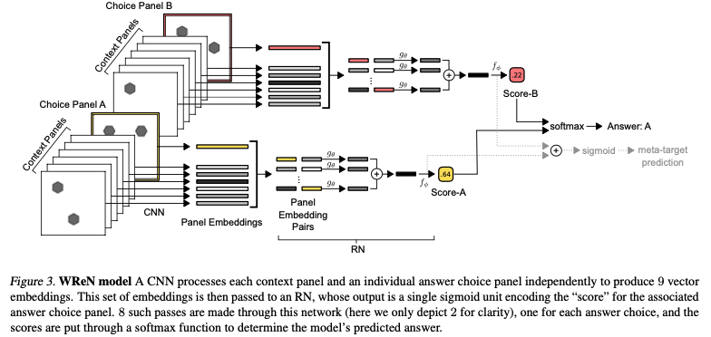
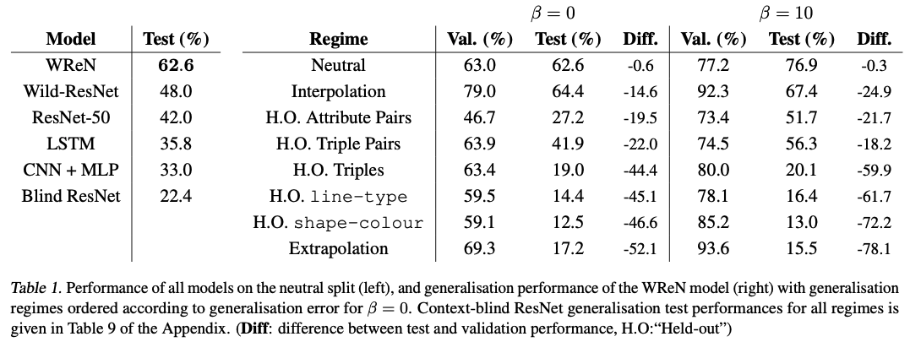

# Measuring abstract reasoning in neural networks

## Basic Information

| 引用情報 |                                                           |
| -------- | --------------------------------------------------------- |
| 筆者     | D.G.T Barrett, F Hill, A Santoro, A.S Morcos, T Lillicrap |
| 所属     | DeepMind                                                  |
| 会議     | Proceedings ICML2018                                      |
| 年       | 2018                                                      |
| 引用数   | 34                                                        |
| リンク   | https://arxiv.org/abs/1807.04225                          |

## どんなもの

ニューラルネットワークのAbstract reasoningの性能を測るIQテストのようなデータセットを作成し、reasoningを促進するようなモデル構造を提案した論文。
筆者らはtrainとtestの乖離具合を様々に試し、提案したモデルが非常によくできる場合とあまりうまく行かない場合があることを確認した。

人間と同等のabstract resasoningの能力を機械が持っているかどうかを測るにはRaven's Progressive Matrices (RPMs)のようなVisual Intelligence Testなどを用いることが
一つの案としてあげられる。これらのtestはデータを"覚えさせる"ようにしてhackされてしまう可能性はあるものの、抽象的な概念を機械が獲得できるかを測るのには適している。この考えを元に
筆者らは**abstract visual questionをまとめた巨大なデータセットを作成し**、

1. 最先端のNNは十分なデータを用意すれば複雑で人間レベルの抽象化能力を獲得できるのか?
2. もし可能ならばこの能力はデータ中の抽象概念の量によってどの程度汎化するか?

というresearch questionに答えられるようにした。また、筆者らはResNetなどのよく知られたアーキテクチャはうまく行かないことを確認した上で**Relation Network**と呼ばれるNeural Networkが他のアーキテクチャに比べて遥かにうまくいくことを示した上で、うまく行かない場合もあることを示した。そして最後に、auxiliary trainingを用いることでモデルの汎化性を高める
アイデアを示した。

## 先行研究に比べてどこがすごい

* RPMsに似たデータセットProcedurally Generated Matrices(PGM)を作成し、その自動作成方法を紹介した
* いくつかのよく知られた手法がうまく行かないことを示した上でそれよりいい性能を示せるモデル(Wild Relation Network)を提案した

## 技術や手法のキモはどこ

### PGM generation

1. 以下のprimitiveからのサンプリングをする。PGMの構造`S`は{[`r`, `o`, `a`]}から決定される。4つまでこのtripleを持てるようにした。
   * relation types (`r`): `progression`, `XOR`, `OR`, `AND`, `consistent union`
   * object types (`o`): `shape`, `line`
   * attribute types (`a`): `size`, `type`, `color`, `position`, `number`
2. `r`に関連する各`a`について値`v`を選ぶ。例えば、`a`が`color`なら`0-255`の間の値を取る。例えば`r`が`progressive`ならこの色の値はだんだんと濃くなるようにサンプリングされる必要がある。
3. `r`に関連しない`a`について値`v`を選ぶ。
4. レンダリングする。

### Models and Experimental setup

正しい答えを選ぶ形式のためsoftmaxを使う。

1. CNN-MLP
2. ResNet
3. LSTM
4. Wild Relation Network
5. Wild ResNet: Wild Relation NetworkのRN部分をResNetにしたもの
6. Context-blind ResNet: Context抜きにするとランダムと同じ性能になるはずだが、統計的特徴でズルができないか確認するモデル

を試した。以下、Wild Relation Network(WReN)について



モデルは1次元のスコア`$s_k$`を与えられた候補それぞれについて出力する。最も高いスコアがついた候補が選ばれる仕組み。スコアは

```{latex}
s_k = RN(X_k) = f_{\phi}\left(\sum_{y, z\in X_k} g_{\theta}(y, z) \right)
```

と計算される。`$X_k = \{x_1, x_2, \cdots, x_8\} \cup \{c_k\}$`であり、`$c_k$`は候補パネルのベクトル表現であり、`x_i`は文脈パネルのベクトル表現である。これらのベクトル表現はCNNを通して作られる。

### Auxiliary training

汎化性能を上げるためAuxiliary trainingを用いる。PGMで似たrelation, object, attribute typeを用いた質問は似たような表現になるはず、という仮説を元に、(`shape`, `line`, `color`, `number`, `position`, `size`, `type`, `progression`, `XOR`, `OR`, `AND`, `consistent union`)をエンコードしたbinary stringを`meta-target`としてこれらのラベルを予測するモデルを作成し、Lossを`main-target`のものと重み付け和にして学習した。

## どうやって有効だと検証した

PGMで検証。



## 議論はある

1. NNはabstract reasoningができると主張している。これを行うために、raw pixel inputからlogical operationsやarithmetic progressionsと言った抽象概念を学習し、それを今までにみたことがないサンプルに適用するというプロセスが必要。Wild Relation Networkはこれが部分的にできる。また、Auxiliary trainingで精度向上
2. 人間とは違いモデルは異なるtrain pairから共通の概念を学習しているように見える。ただ、外挿的なのは無理っぽい。

## 次に読むべき論文は

Learning to Make Analogies by Contrasting Abstract Relational Structures, Hill, Santoro et al (2019)
