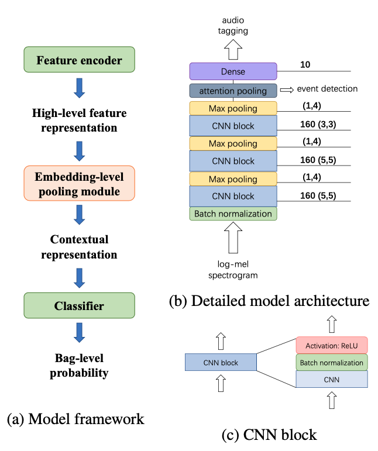

# GUIDED LEARNING CONVOLUTION SYSTEM FOR DCASE 2019 TASK 4

## Basic Information

| 引用情報 |                                                                                       |
| -------- | ------------------------------------------------------------------------------------- |
| 筆者     | Liwei Lin , Xiangdong Wang, Hong Liu, YueLiang Qian                                   |
| 所属     | Chinese Academy of Sciences                                                           |
| 会議     | DCASE                                                                                 |
| 年       | 2019                                                                                  |
| 引用数   | 7                                                                                     |
| リンク   | http://dcase.community/documents/challenge2019/technical_reports/DCASE2019_Lin_25.pdf |

## どんなもの

室内環境におけるSound Event Detection(SED)タスクを取り扱っていたDCASE2019 Task 4の優勝解法。
Embedding-level attention pooling moduleを用いたCNNによりweaklyな教師あり学習を行っている。

* 複数イベントの共起による干渉効果を考慮するために、disentangled featureと組み合わせる
* unlabeled dataを使うために半教師ありのguided learningを用いる
* 適応的な窓幅のmedianフィルタで後処理

を行うことでFスコアで45.43%を達成した

## 先行研究に比べてどこがすごい

### DCASE 2019 Task 4について

DCASE2018 Task4の後発タスクであり、weakly-labeled dataとunlabeled dataを用いて大規模なSEDを行うタスクだった。DCASE2018との違いはDCASE2019ではstrongly annotatedな合成データセットが提供されていた(DCASE2018が難しすぎたのでは？？)。

DCASE2019では以下の5つの課題があった。

1. weakly-labeledなデータからいかに効率的に学習を行うか
2. unbalancedなデータセットからいかに学習するか
3. weakly labeled dataに対するweaklyな教師あり学習とunlabeled dataに対する半教師あり学習をどう組み合わせるか
4. strongly annotatedな合成教師データは役に立つか
5. 各イベントカテゴリに対してより精度の高い境界を出せるような後処理をどう設計するか

### Contributions

これらの課題に対して、このテクニカルレポートでは以下のような解決策を取っている

1. 1 & 2に対してはembedding-level attention pooling moduleを用いたCNNとdisentangled featureを用いている
2. 3 に対してはGuided Learningと呼ばれるsSLを用いている
3. 4に対してはstrongly annotated datasetもweakly datasetとして扱った
4. window sizeが可変なmedian filterをモデルの出力の確率に対して用いて後処理をした

## 技術や手法のキモはどこ

### モデルの構造 (Audio tagging)



入力はlog-mel spectrogram

1. Feature Encoder

CNN + BN + ReLUを組み合わせたCNN blockを三層積み重ねる

2. embedding-level attention pooling module

Feature Encoderによってエンコードされたあとの高レベルな特徴表現を受け取り、コンテクスト表現にする。C個のイベントカテゴリがあるとすると、embedding-level attention poolingでは高次の特徴表現をC個のコンテキスト表現に変換する。最終的にこのC個のコンテキスト表現を分類器に渡すことで音声クリップごとの確率が得られる。

3. 分類器 (Audio Taggingの方)

各クラスにつきFC層 + Sigmoid

このモデルがweakly-supervised learningをできるのはembedding-level attention pooling moduleのおかげとのこと。$`x=\{x_1,\cdots,x_T\}`$が高次の特徴表現だったとし、$`y=\“y_1,\cdots,y_C\} (y_c \in \{0, 1\})`$が正解ラベルのクラスであるとする。ただし$`T`$は全フレーム数(time stepの数?)とする。

続いて、各カテゴリcにつき、embedding-level attention poolingがそれぞれの時間フレームに対し異なる重み$`a_c = \{a_{c1}, \cdots, a_{cT}\}`$を$`x`$の各フレームにつき与える。結果としてコンテキスト表現$`h=\{h_1, h_2,\cdots,h_C\}`$は

```{latex}
h_c = \sum_t a_{ct}\cdot x_t
```

と計算される。$`x`$においてクラス$`c`$の予測に重要なタイムフレーム$`x_t`$には大きな$`a_{ct}`$が与えられ結果として$`h_c`$に対して大きく貢献する。この$`a_{ct}`$は以下のように計算される。

```{latex}
a_{ct} = \frac{\exp((w_c^T x_t + b_c) / d)}{\sum_k \exp((w_c^T x_k + b_c) / d)}
```

ここで$`d`$は$`x`$の次元数と同じである。

**重要** $`a_{ct}`$はフレームレベルの音声イベント確率を表現できる。(多分detecionで使う？)

```{latex}
\hat{p}(y_c | x_t) = \sigma(w_c^T x_t + b_c)
```

音声クリップごとのイベント存在確率とフレーム毎のイベント存在確率はそれぞれ

```{latex}
\phi_c(x) = \begin{cases}
    1, & \hat{\mathrm{P}}(1|x) \ge \alpha \\
    0, & otherwise
\end{cases}
```

```{latex}
\varphi_c(x, t) = \begin{cases}
    1, & \hat{p}(1 | x_t) \cdot \phi_c(x) \ge \alpha \\
    0, & otherwise
\end{cases}
```

$`alpha`$は0.5とおいたとのこと。

### Disentangled featureについて

高次の特徴を事前情報に基づいて各イベントカテゴリ毎の部分空間にモデル化するDisentangled feature(DF)を用いた。これは、複数のイベントが共起して干渉する効果を和らげるためであると述べられている。

$`\chi^d(x\subset\chi^d)`$がfeature encoderによって変換されたd次元の特徴であるとする。また、$`\beta=\{e_1, e_2, \cdots, e_d\}`$が$`\chi^d`$の直行基底であるとする。DFは適切に基底を選択することで各カテゴリに関する部分空間を構成する。カテゴリ$`c`$の特徴空間$`\chi_c^{'}`$は

```{latex}
\beta_c^{'} = \{e_1, e_2, \cdots, e_{k_c}\} \\
k_c =
```

## どうやって有効だと検証した

## 議論はある

## 次に読むべき論文は
