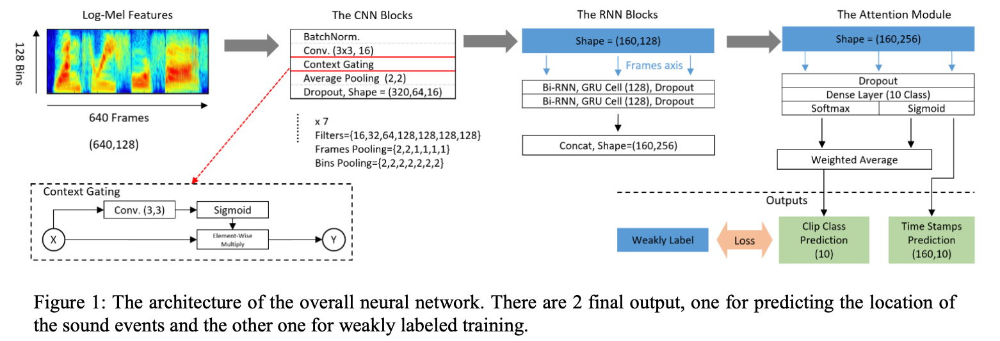
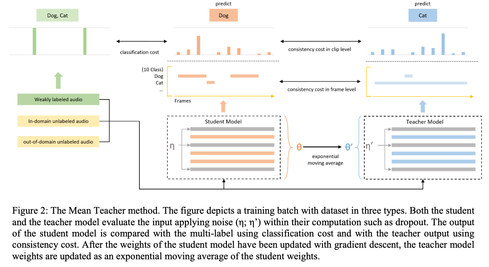

# MEAN TEACHER CONVOLUtION SYSTEM FOR DCASE 2018 TASK 4

## Basic Information

| 引用情報 |                                                                                      |
| -------- | ------------------------------------------------------------------------------------ |
| 筆者     | Lu JiaKai                                                                            |
| 所属     | PFU SHANGHAI Co. LTD                                                                 |
| 会議     | DCASE                                                                                |
| 年       | 2018                                                                                 |
| 引用数   | -                                                                                    |
| リンク   | http://dcase.community/documents/challenge2018/technical_reports/DCASE2018_Lu_19.pdf |

## どんなもの

DCASE2018 Task4のLarge-scale weakly labeled semi-supervised sound event detection in domestic environmentsの優勝解法。context-gating CNNとRNNを組み合わせてmean-teacherモデルというものを用いた。

クリップ内の音イベントについてクリップごとにラベルが存在するweakly-annotatedな状況や、unlabeledなデータが大量にあるという状況は実際の状況に近くDCASEのコンペティションがどんどん現実の問題設定に近づいている。

### 前提

DCASE2018 task4のデータは

1. weakly labeled dataset
2. unlabeled in-domain dataset
3. unlabeled out-of-domain dataset

の三つからなり、全部で10クラスの音が様々な環境で存在する。

weakly-labeledなデータは1578クリップあり、unlabeled in-domain datasetは14412クリップ、unlabeled out-of-domain datasetは39999クリップ存在した。音クリップは全てモノラルで44100Hzでサンプリングされ、最長で10秒だった。音イベントの中には重なりがあるものもあった。

## 技術や手法のキモはどこ

### 前処理

1. 22050Hzへのダウンサンプリング
   高い周波数帯はあんまり重要ではなかったから。16000Hzまで下げてしまうと、いくつかの音イベント種で周波数帯が似通った物どうしで混乱が生じる可能性があったので22050Hz
2. log mel-spectrogramの抽出
   128-bin、2048-window、365-hopで抽出することで10秒のクリップを640フレームの特徴に変換した。

### モデル

いくつか性能向上に寄与した方法がある

#### Context Gating

スペクトログラム中のframe軸(時間軸)で重要な部分により注意を払うようにするためにContext GatingをCNNの活性化関数として用いた。Context Gatingは

```{latex}
Y = \sigma(\omega \cdot X + \beta) \odot X
```

$`\sigma`$はシグモイド関数で$`\odot`$は要素ごとの積、$`X\in R^n`$は入力された特徴ベクトル。$`\omega \in R^{n\times n} , \beta\in R^n`$は学習可能なパラメータ

$`\sigma(\omega \cdot X + \beta)`$の出力はベクトルとなり、入力された特徴のそれぞれについてどの程度出力するかを調節するゲートの役割をはたす。

このContext Gating層はGated Linear Unitをシンプルにしたバージョンである。

#### Attention Output

最終出力層においてSigmoidとSoftmaxの二つの出力をする。sigmoidはフレームごとの予測をし、softmaxは音イベントのクラスの予測をする。最終的なクリップ単位での予測は

```{latex}
Y^' = \frac{\sum_t^T sigmoid(x)\odot softmax(x)}{\sum_t^T softmax(x)}
```

で計算する。この出力は音クリップレベルの予測なので普通にweakly-labeledなデータを用いて学習できる。



#### Mean Teacher



teacher modelはstudent modelのEMAのweightを用いて分類を行い、学習時には二つのロスを計算する

1. classification cost
2. consistency cost

consistency costはclip-levelのclass consistencyとframe-levelのclass consisteencyからなり、student modelとteacher modelのlabeled / unlabeledな音クリップへの適用結果のロジットを比較することで得られる。

テスト時にはstudent modelもteacher modelもどちらでも予測に使えるが、teacher modelはアンサンブル効果があるのでそっちを使った。

#### post-process

median filterを使っている

## どうやって有効だと検証した

## 議論はある

重要なポイントは抑えられているが細かい部分は書いていない部分が多い・・・

## 次に読むべき論文は
