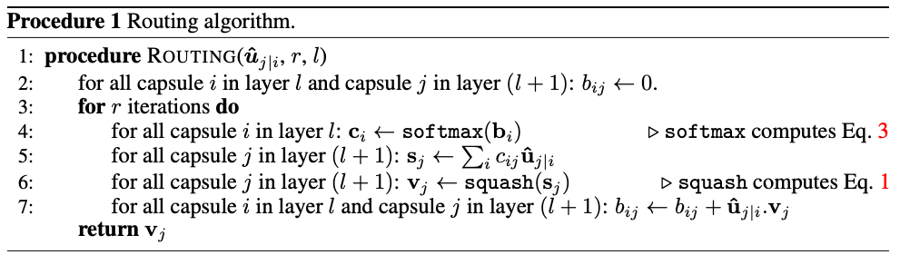

# Dynamic Routing Between Capsules

## Basic Information

| 引用情報 |                                                                        |
| -------- | ---------------------------------------------------------------------- |
| 筆者     | Sara Sabour, Nicholas Frosst, Geoffrey Hinton                          |
| 所属     | Google Brain                                                           |
| 会議     | NIPS                                                                   |
| 年       | 2017                                                                   |
| 引用数   | 1484                                                                   |
| リンク   | https://papers.nips.cc/paper/6975-dynamic-routing-between-capsules.pdf |

## どんなもの

Capsule Networksの提案論文。
以下のようなCapsule Networksを提案し、discriminativeに学習することでMNISTで最高性能を発揮し、重なった数字の認識に関してCNNを遥かに上回る精度を達成した。

**Stacked Capsule Auto-Encoder(2019)で述べられているようにdynamic routingはpart-wholeの関係に根ざしているのでおそらくうまく行かないアイデア**

### Capsuleとは

物体(object)やその部分といったentityのパラメータをactivityベクトルで表現するニューロン群をさす。

### Capsule Networksとは

activity vectorの長さ(ベクトルの長さ、ノルムのことだと思う)を用いてentity(実体)が存在するかどうかの確率を表現し、activity vectorの向きによってそのentityのパラメータを表現した。あるレベル(層のこと？)において活動している(active)capsuleは高次のレベルのcapsuleのパラメータに関して変換行列を通して予測を行う。複数の予測が一致した場合には高次のcapsuleがactiveになる。また学習において**iterative routing-by-agreement mechanismというものを用いている。**すなわち、低次のcapsuleは、低次のcapsuleからやってきた予測に対して大きなscalar productを出すようなactivityベクトルをもつ高次のcapsuleに対して予測を送りやすいようにしてある。

### モチベーション

物体のpart-whole relationを捉えたい。このpart-whole relationは本来、画像中のentity間をつないでいるためparse treeのような構造を構築するはずである。画像を入力したときにそこに写っているentityをつないだparse treeを自動で"on the fly"に構築することが目標。このparse treeの構築にdynamic routingを用いている。各層にはcapsuleと呼ばれるニューロン群が存在し、activeなcapsuleどうしを繋ぐことでparse treeを構築する。

dynamic routingと呼ばれるのはactiveなcapsuleがより上の層のcapsuleを親として選び出す**iterativeな**ステップである。高次の層においてはこのプロセスはpartsをwholeに割り当てるような問題となる。このやり方(**routing-by-agreement**)は、max-poolingのようなprimitiveなroutingより良い。

### CNNとの比較

CNNはfeature detectorがtranslationの際に複製される、すなわち同じfeature detectorが画像中のどこであっても適用されるという工夫を凝らしたことにより大きな成果を達成した。これと同様にCNNのニューロンをcapsuleに、poolingをroutingに置き換えても同様の利点は得られる。CNNと同様にcapsuleは高次のレイヤーにあればあるほど広範囲の特徴をカバーする。max-poolingと異なるのは、entityの位置の情報を捨ててしまわず、**low-levelのcapsuleにおいてはcapsuleが活性化することにより位置の情報をエンコードした"place-coded"な働きをし**、より高次の層においては位置の情報は"rate-coded"になる。

また、高次の特徴ほど次元数は増えていく必要があると述べられている。

## 先行研究に比べてどこがすごい

## 技術や手法のキモはどこ

### capsuleの入出力の計算

capsuleという概念を実装する方法は様々にあるがシンプルな方法でもうまくいくことを示している。
entityの存在確率をベクトルの大きさで測るので非線形の`squashing`を用いている。これにより大きなベクトルは1に近づき、小さいベクトルは0に近づけられる。

`v_j`はcapsule`j`のベクトルの出力であり、`s_j`は入力の総和である。最初の層のcapsuleを除いてcapsule`j`への入力`s_j`は全ての予測ベクトルの和である。このは、前の層のcapsuleの出力に重みを描けたものである。

この重み`c_ij`はiterative dynamic routing processによって計算される係数である。これはあるcapsule`i`とその一つ上の層の全capsuleとの間に計算されて足し合わせると1になり、`routing softmax`という関数で値が決められる確率値でcapsule`i`がcapsule`j`とカップリングされる確率を表している。

このロジットも学習される重みであり、位置と2つのcapsuleのタイプに依存して決められる。このカップリング係数は各capsuleの出力と前の層のcapsuleの予測との適合度を元に繰り返しrefineされる。適合度は

## どうやって有効だと検証した

## 議論はある

## 次に読むべき論文は
