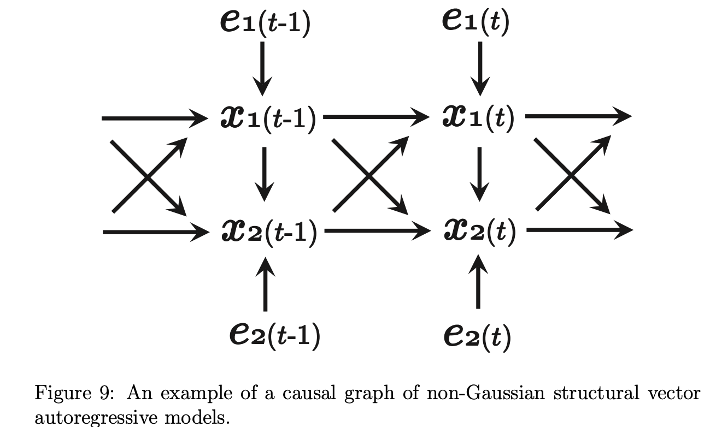

# LiNGAM: Non-Gaussian methods for estimating causal structures

## Basic Information

| 引用情報 |                                                                       |
| -------- | --------------------------------------------------------------------- |
| 筆者     | Shohei Shimizu                                                        |
| 所属     | The Institute of Scientific and Industrial Research, Osaka University |
| 年       | 2014                                                                  |
| 引用数   | 38                                                                    |
| リンク   | http://www.ar.sanken.osaka-u.ac.jp/~sshimizu/papers/Shimizu13BHMK.pdf |

## どんなもの?

LiNGAMの発案者による、LiNGAMモデルの発展系等のまとめを行った論文。因果推論の基礎などから書かれている。

発展系として紹介されているのは

1. 未観測共通原因がある場合の手法
2. 時系列に対して
3. 非線形拡張
4. 離散変数への拡張

統計的因果探索本の英語論文版感がある。

## 先行研究に比べてどこがすごい?

様々な拡張についてまとめられている。

古いほうのLiNGAM論文で提案されたICAを用いたアプローチの他にもう一つ因果的順序を効率的に決定する方法が述べられている。

### ICA-LiNGAM

ICAを用いたLiNGAMの推定法。高速だが**初期値依存で局所解に陥りやすい**という欠点があったり、勾配ベースのICAでは最適ステップ数の調整が必要で**パラメータチューニングが煩雑.**

### DirectLiNGAM

全ての前提条件が満たされており無限のデータがあれば、変数の数と同じステップ数で収束することが保証されている。因果的順序を決定するために**異なる2変数の間で回帰と独立性の検定を繰り返す。**

### モデルの仮定が満たされていないことを検知する手法

LiNGAMモデルの仮定

1. 誤差項が非ガウス
2. 線形
3. 未観測共通原因がない

が満たされていないことを検知する手法の紹介もある。例えば、非ガウス性の仮定が満たされているかどうかを確かめるために、**予測された外生変数にKolmogorov-Smirnov検定を適用する**ことを挙げている。

また、外生変数の間の独立性を独立性の検定で確かめることも挙げられている。

## 技術や手法のキモはどこ?

様々な拡張が紹介されている。

### 未観測共通原因(Latent confounding variables)への対応

未観測共通原因があるとモデルの推定精度が落ちるので対応した。次のようにモデルを定式化

```{latex}
x = \mathbf{B}x + \mathbf{\Lambda}f + e
```

`f`が未観測共通原因をまとめた変数ベクトル。このベクトルは未観測共通原因の変数`f_q (q=1, ..., Q)`から構成されそれぞれの変数は独立である。このモデルもICAを用いることで推定可能である。ただし、観測変数より潜在変数が多い場合のICAはいい解法が見つかっておらず局所解に陥りやすい。

ベイズ推論の方法を援用してpriorを置くなどがあげられる。

### 時系列への拡張

瞬時に伝わる因果効果についてはLiNGAMを用いる一方で、時間遅れがある場合には自己回帰モデルを用いるという方針のもと、二つのモデルを結合した以下のモデルを用いる。

```{latex}
x(t) = \sum_{\tau=0}^h \mathbf{B}_{\tau}x(t - \tau) + e(t)
```

`x(t), e(t0`はそれぞれ時間tにおける観測変数と外生変数を表す。`B_tau`は時間遅れtauがある結合強度行列である。時間遅れは0から始まるためこれは瞬時に伝わる因果効果を表す。この因果効果`B_0`は通常のLiNGAMと同様非巡回になるようにしなければならない。

`e_i(t)`がnon-Gaussianかつ、相互・タイムステップ間で独立ならば識別可能である。モデルパラメータの単純な推定手法としては、自己回帰モデルをfitした後、残差に通常のLiNGAMを適用するというものである。



### Cyclic models

巡回がある場合への拡張。i) `B`の最大の固有値が1より小さい(平衡解に落ち着く条件) ii) サイクルがdisjoint(互いに素、同じ変数が複数のサイクルに含まれていないこと?) iii) 自分自身に戻るサイクルがないこと(対角要素が非ゼロにならない状態がないこと)を満たすとき識別可能。

### Nonlinear Extensions

非線形モデルへの拡張。いろいろあるっぽい。。後で書く。

## 次に読むべき論文は?

Kawahara, Y., Shimizu, S., and Washio, T. (2011). Analyzing relationships among ARMA processes based on non-Gaussianity of external influences. Neurocomputing, 4(12–13):2212–2221

Gao, W. and Yang, H. (2012). Identifying structural VAR model with latent variables using overcomplete ICA. Far East Journal of Theoretical Statistics, 40(1):31–44.

のどちらか(時系列拡張)
