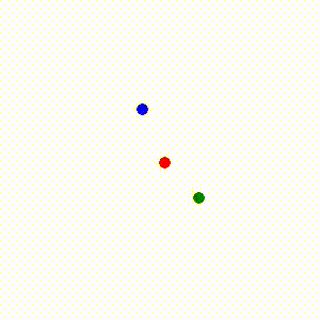

# Interaction Networks for Learning about Objects, Relations and Physics

This repo contains unofficial implementation for the paper: Interaction Networks for Learning about Objects, Relations and Physics [1]. We implemented this code in Python3 and PyTorch, and tried to reproduce the results reported in the paper.

## Environments

The codebase is developed with Python 3.6.7. Install requirements as follows:

```sh
pip install -r requirements.txt
```

## Simulation

We've implemented basic `Gravity` relations between objects.



TBC
