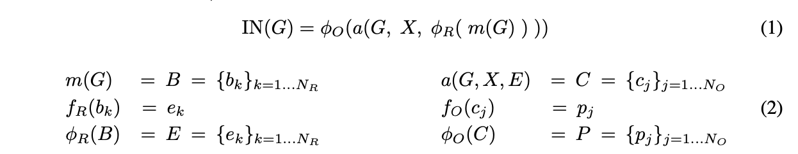
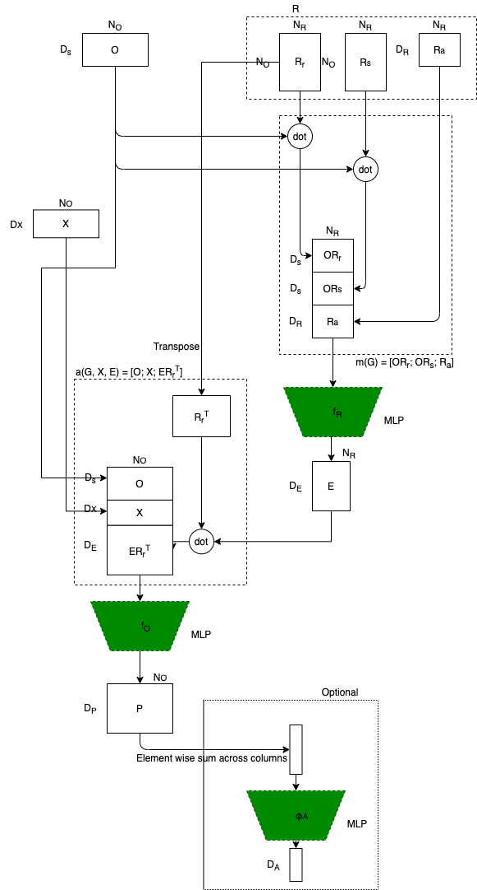
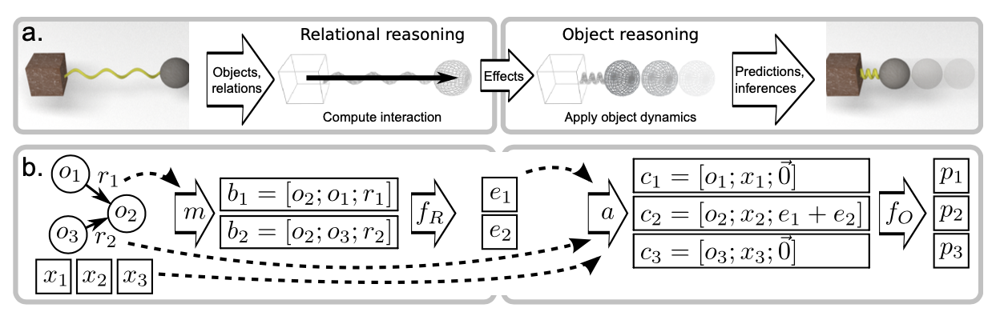

# Interaction Networks for Learning about Objects, Relations and Physics

## Basic Information

| 引用情報 |                                                                                                             |
| -------- | ----------------------------------------------------------------------------------------------------------- |
| 筆者     | Peter W. Battaglia, Razvan Pascanu, Matthew Lai, Danilo Rezende, Koray Kavukcuoglu                          |
| 所属     | Google DeepMind                                                                                             |
| 会議     | NIPS                                                                                                        |
| 年       | 2016                                                                                                        |
| 引用数   | 405                                                                                                         |
| リンク   | https://papers.nips.cc/paper/6418-interaction-networks-for-learning-about-objects-relations-and-physics.pdf |

## どんなもの

物体どうしの相互作用や抽象的な性質の推論が可能な*Interaction Network*の提案。DNNを使って入力されたグラフから物体やそれらの関係を推論する。n体問題や剛体の衝突などの物理系でのシミュレーションやエネルギーなどの抽象的な量の算出などを行える、learnableな物理エンジンである。

Interaction Networksは

1. 構造化モデリング
2. シミュレーション
3. Deep Learning

の三つを組み合わせている。構造化モデリングは物体間の明示的な関係を利用することができ、物体間の推論などについても様々な利用方法がありうる。シミュレーションは動的なシステムを抽象化して個々の要素が複雑な相互作用の中でどのような挙動をするかを予測することができる。Deep Learningは非常に柔軟でスケーラブルな学習と推論の枠組みを提供する。

Interaction Networksでは、relationに関する推論とobjectsに関する推論は明示的に分ける。これにより、物体の数やrelationの数に制約なくその組み合わせの数だけ対応できるようになっている。また、relationを明示的な入力として受けることにより全ての物体間の関係を考える必要をなくしている。

## 先行研究に比べてどこがすごい

グラフに関してニューラルネットワークによって推論を行う、Graph-Neural-Networkに影響を受けている。Graph-Neural-Networkとはノードとエッジからなる枠組みに対応できるNNである。

一方Interaction Networkの挙動自体は物理シミュレーションエンジンに似ている。すなわち、物理的な物体間の相互作用とダイナミクスを近似したルールを適用することで状態列を生成する点についてである。

物理的な系における推論でのこれまでのAI研究では、物理的な予測や推論に常識的な知識や、シミュレーションの技術、qualitative representations(よく分からん)を用いていた。

## 技術や手法のキモはどこ

object-centricな作用(一つのobjectに働く作用)と、relation-centricな作用(複数の物体の間に働く作用)を分けて考える。

object-centricな作用の計算には関数$`f_O`$を用いる。これはobjectの時刻$`t`$における状態$`o_t`$を受け取り、次の時刻の状態$`o_{t+1}`$を出力する。複数のobjectsが同じ規則に従っている場合、$`f_O`$はそのそれぞれに対して適用される。

objectsどうしのinteractionがある場合には、$`f_O`$の挙動は変化する。この場合まず、$`f_R`$がrelation-centricな作用を計算する。その上でその出力も$`f_O`$は引数として受け取る

```{latex}
e_{t+1} = f_R(o_{1, t}, o_{2, t}, r), o_{2, t+1} = f_O(o_{2, t}, e_{t+1})
```

関係$`r`$は例えばバネ定数のような関係にまつわる属性である。

これらの定式化はグラフ$`G=<O, R>`$を用いることでより複雑なシステムに対して拡張される。この時問題設定として、attributed, directed multigraphを考える。これは物理系の関係はバネ定数のような属性をもったり、複数の関係が同時に働く(例えば剛体の相互作用と磁気的な相互作用は同時に起こりうる)ことがあるからである。

$`N_O`$個のobjectsと$`N_R`$個のrelationsが存在するシステムにおいてはInteraction Networks(IN)の入力は

```{latex}
O = \{o_j\}_{j=1\cdots N_O}, R = \{<i, j, r_k>_k\}_{k=1\cdots N_R}~where i\neq j, 1\le i,j\le N_O, X=\{x_j\}_{j=1\cdots N_O}
```

と表される。$`X`$は各objectsに外部から入力される効果である。INは



と表現される。$`b_k`$はrelationのtripletであり$`B`$はその集合である。$`\phi_R`$は$`f_R`$を$`b_k`$に適用することで$`e_k\in E`$、すなわち相互作用効果を予測するネットワークである。$`a`$は集約関数であり、全ての相互作用効果を集めてreciever objectに適用し、$`O`$と$`X`$をまとめ上げてobjectsモデルの入力$`c_j\in C`$を構成する。objectモデル$`\phi_O`$は相互作用と物体内でのダイナミクスがどう物体の状態に影響するかを$`f_O`$を$`c_j`$それぞれに対して適用して$`p_j\in P`$を返すことで予測する。物理系であれば$`P=O_{t+1}`$である。
しかし、$`p_j\in P`$をさらに別の集約関数$`g`$と組み合わせて抽象化モデル$`\phi_A`$などに入力して単一の出力$`q`$を返すようにすればpotential energyの予測などにも使える。

### 実装



前の定式化において関数系などには制約はなかったが、実装においては関数表現としてMLPを用いた。$`O`$を$`D_S\times N_O`$の行列とし各列が物体の$`D_S`$の長さの状態ベクトルとした。関係のtriplet$`R=<R_r, R_s, R_a>`$について、$`R_r`$と$`R_s`$は$`N_O\times N_R`$の二値行列として表現し、$`R_a`$は$`D_R\times N_R`$の行列とした。ここで$`D_R`$の長さの列がそれぞれの関係の属性を表現している。例えば



のbにおいては

```{latex}
R_r = \left[
    \begin{matrix}
        0 & 0 \\
        1 & 1 \\
        0 & 0
    \end{matrix}
\right] \\

R_s = \left[
    \begin{matrix}
        1 & 0 \\
        0 & 0 \\
        0 & 1
    \end{matrix}
\right]
```

となる。$`X`$は$`D_X\times N_O`$の行列であり、各列がそれぞれのobjectに適用される外部効果を表現した$`D_X`$次元のベクトルである。relationのtripletをまとめる関数は単純にconcatenation$`m(G) = [OR_r;OR_s;R_a]`$を行うだけとする。

$`f_R`$はMLPであるとし、その出力は相互作用効果を表現した$`D_E`$次元のベクトルであるとする。$`\phi_R`$はその効果をまとめ上げて$`D_E\times N_R`$の効果行列にする。

集約関数$`a`$の入力は$`G, X, E`$でありその出力は$`a(G, X, E)=[O; X; \bar{E}]=C`$である。この$`\bar{E}`$は各reciever objectにおける各relationの和をまとめた関数であり、$`\bar{E}=ER_r^T`$と表される$`D_E\times N_O`$の行列である。

この$`C`$は$`(D_S+D_X + D_E)\times N_O`$の行列であり、これが関数$`\phi_O`$の入力となる。

## どうやって有効だと検証した

## 議論はある

## 次に読むべき論文は
