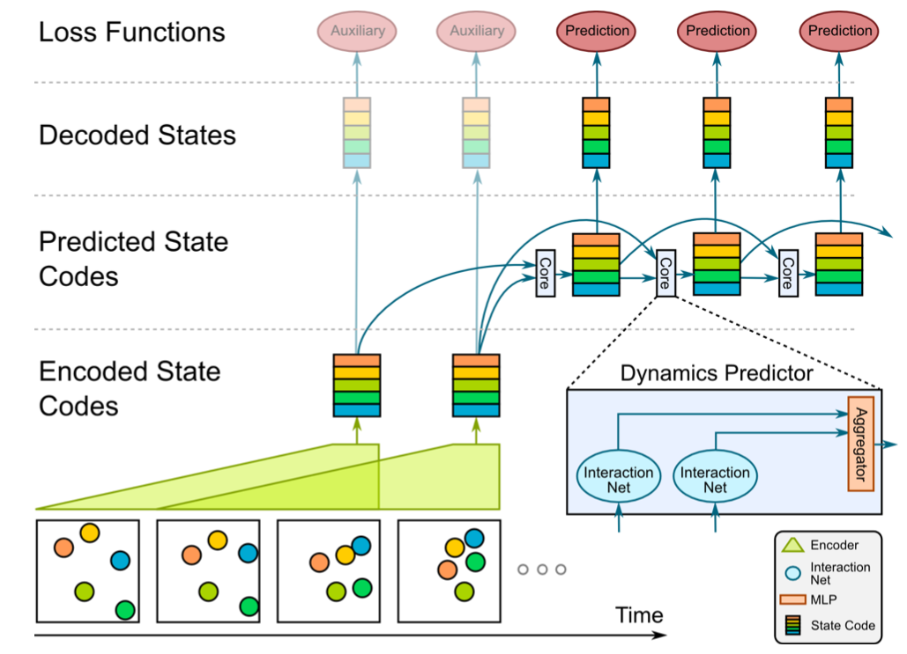
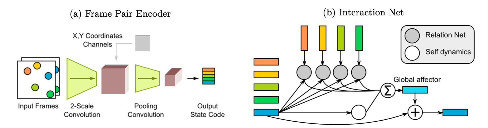
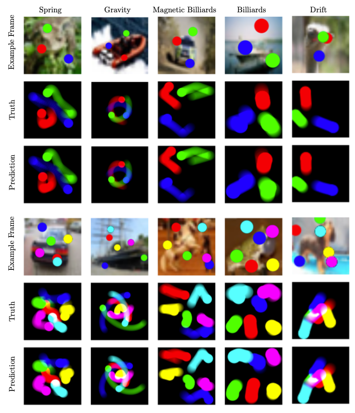

# Visual Interaction Networks: Learning a Physics Simulator from Video

## Basic Information

| 引用情報 |                                                                                                   |
| -------- | ------------------------------------------------------------------------------------------------- |
| 筆者     | Nicholas Watters, Andrea Taccheti, Theophane Weber, Razvan Pascanu, Peter Battaglia, Daniel Zoran |
| 所属     | DeepMind                                                                                          |
| 会議     | nips                                                                                              |
| 年       | 2017                                                                                              |
| 引用数   | 145                                                                                               |
| リンク   | https://deepmind.com/research/publications/visual-interaction-networks                            |

## どんなもの

(パッと見[Relation Networks](../abstraction-and-reasoning/A-simple-neural-network-module-for-relational-reasoning.md)によく似ている)

視覚的な観測から物体の挙動を予測するシステム、Visual Interaction Networksの提案。CNNによる認識機能(perceptual front-end)とinteraction networksによる物体の挙動予測を組み合わせる。joint trainingにより、perceptual front-endは画像入力からいくつかの物体の潜在表現を得られるようになり、挙動予測器は物体のダイナミクスとinteractionを連続適用することで任意の長さの物体の軌道を予測できるようになる。

わずか6ステップのビデオ入力からその続きの挙動を予測することができたほか、不可視の物体が可視の物体に与える影響から、その不可視の物体の将来の状態の予測もできた。

Visual Interaction Networks(VIN)は入力画像と対応する状態量の系列から学習がなされる。VINは様々な物体どうしの相互作用が絡んでくる様々な物理システムを、暗黙のうちに内部の挙動や相互作用効果を学習することで、近似できるようになる。

VINはCNNのvisual encoderとinteraction network(IN)を組み込んだRNNからなる。

## 先行研究に比べてどこがすごい

画像から物理系の挙動を予測する研究は他にもいくつか存在するがその中でも最高性能。また、モデルベースでその中のパラメータをfittingするというアプローチはもいくつかある。

## 技術や手法のキモはどこ

### モデル

VINは以下のコンポーネントから成り立つ。

* visual encoder

画像frameのtripletを入力とし、状態量をエンコードしたベクトル列を出力する。一つ一つが画像中のobjectに対応する。各ベクトルは物体の位置と速度をエンコードした分散表現になっている。encoderはframeの列に対しsliding window方式で適用され、状態ベクトル列に変換する。

* dynamics predictor

状態ベクトルの列を受け取り、次の状態の状態ベクトルの候補を予測する。複数のIN coreから構成され、それぞれが異なる時間的なオフセットを受け取り状態ベクトル候補に変換する。これらの候補はMLPによって集約され次の状態の状態ベクトル予測となる。

* state decoder

状態ベクトルを状態に変換する。状態とは各objectの位置と速度である。training targetは正解のstateである。

### Visual Encoder

3つの画像列からCNNによって状態ベクトルを作成する。画像フレームのペアを受け取り状態ベクトル候補を作成するframe pair encoder $`E_{pair}`$をもち、3フレームの中の二つの連続するframeに対して適用される。二つの状態ベクトル候補はslot-wise MLPによって集約され状態ベクトルになる。

$`E_{pair}`$はチャネル方向にstackされたframeペアに対して二つの異なるカーネルサイズのCNNを適用し、$`x, y`$座標のチャネルを加え(coordsconv?)、convolutionとmax-poolingをwidthとheightが1になるまで適用し続ける。結果のテンソルの形は$`1\times 1\times (N_{object} \cdot L_{code})`$になり、
それを$`N_{objects}\times L_{code}`$に変換する。二つのstate codeはMLPに入力され最終的な状態ベクトルになる。

ポイントは同じ$`E_{pair}`$が二つの画像ペアに適用されることで時間的な関係を考慮したconvolutionができることと、coordconvの利用。

### Dynamics Predictor

Interaction Networks(IN)の変種で、大きな違いとしては、複数の時間的なoffset(例えば{1, 2, 4}など)に対して集約をしているところ。入力の状態ベクトル列に対してoffset $`t`$がいくつか設定されそれぞれの$`t`$について入力の状態ベクトル列のindex $`t`$の状態ベクトルを入力として別のINが適用され候補の状態ベクトル予測が出力される。これらに対し、slot-wise MLPが集約関数として適用され最終的な予測状態ベクトルが構成される。

このtemporal offsetにより速い動きと遅い動きの両方をうまく扱えるようになる。

### State Decoder

$`L_{code}`$の入力を受け取りsize 4(position / velocity)のベクトルを出力する線形層である。
NOTE: ここの部分普通に次のフレームの出力とかに変えられないかな

state decoderはエンコードされたstate code(auxiliary encoder loss)と予測されたstate code(prediction loss)の両方に適用される。

## どうやって有効だと検証した

5つの物理系のシミュレーションで確認した。これらは挙動の複雑さは高いが、視覚的な複雑さは低いもので、様々な力による色付き物体の相互作用を自然画像を背景に2Dシミュレーションしたものである。以下の5つの法則が全ての物体ペア同士に適用されている。

1. Spring
   各objectペアは互いに不可視のバネ結合で結ばれている。全てのバネは同じ方程式とバネ定数にしたがっている。
2. Gravity
   ニュートンの重力の法則に従っている。
3. Billiards
   遠距離作用は存在せず、互いにぶつかったり境界とぶつかった場合のみ反射する。
4. Magnetic Billiards
   全てのボールが正に帯電しており、クーロン力によって反発し合う。また、境界では通常通り反射する。
5. Drift
   あらゆる力も相互作用も存在せず、一定の速度で物体は移動し続ける。

これらは今までに研究されてきた重力とbilliardsのシステムに背景に自然画像を用いるような変更を加えたものになっている。
一つの制約として、物体の位置、質量、半径などは視覚的にわかるか、グローバルな定数として設定されている。

また、物体が部分的に重なって見えなくなることはあっても完全に見えなくなることはない。一方で、不可視の要素が相互作用などとして働く場合もあるのでそれを模擬したchallengingな要素を足している。

* 不可視のバネの例において
  それぞれのシミュレーションでランダムに選ばれた要素が一つマスクされており、その位置とその効果を推論する必要がある。
* バネとビリアードの例において
  各シミュレーションで物体の半径がランダムに定められ、バネ系においては完全に物体が隠される瞬間もある他、物体の質量もそれぞれ違うため各物体の質量を半径から予測する必要がある。

自然画像の背景にはCIFAR-10を用いている。シミュレーションの中では同じ背景画像が使われている。objectsのレンダリングには15-foldのanti-aliasingを用いているのでpixel resolutionよりもはっきりとした物体位置の捕捉ができる？

各simulationには3~6個の物体が存在しtraining setには$`2.5\times 10^5`$個のシミュレーションが、test setには$`2.5\times 10^4`$個のシミュレーションが含まれそれぞれのシミュレーションは64フレームの長さである。学習には14フレームを用いている。

ベンチマークとして以下のモデルを用いている。

* Visual RNN

Visual encoderはVINと同じだがdynamics predictorがMLPになっている。dynamics predictorはtemporal offsetがあるRNNである。つまり違いとしてはINを用いているかどうかの差にある。

INのweight-sharingがないので、このモデルでは各物体ペアごとに物理法則を学習数r必要があり物体数が増えると非効率である。

* Visual LSTM

dynamics predictorがLSTMになっている。特にLSTM layerはMLPによる前処理器、後処理器がある。temporal offset aggregationは用いないようにしている。MLP postprocesorの出力の状態ベクトルがそのまま次のstepのMLP preprocessorに入力される。

* VIN without Relations

VINからrelation networkが取り除かれている。

* Vision with ground truth dynamics

次のステップではなく今の状態を予測する。これはstatic dynamicsを学習する。test時にはground truthの物理エンジンに対し状態予測を突っ込む。このモデルはvisual componentの性能評価に用いる。

また視覚的な情報からの学習ではなく状態ベクトルからの学習をするIN from StateとLSTM from Stateも実験する。これはvisual encoderがないものである。

### 結果について

エラーの計算方法などについていろいろ書いてあるがVINが一番よかったよという報告。

## 議論はある

この実験設定で重要なのはvisual encoderから入ってくるノイズであると書いてある。state-to-stateのモデルではノイズの少ない状態空間の推定で済むがvisual encoderを使う場合シミュレーションされた画像であっても推定には上界が存在する。
一方で不正確な予測によって蓄積していくエラーの解消などには、このノイズは有利に働く場合がある。特に長期にわたるロールアウトをする場合、state-to-stateな予測よりもいい場合があった。これは画像入力にするあらゆるシステムにありうることなので今後の研究の方向性としてあるんじゃないか？

## 次に読むべき論文は

Wang, Xiaolong, et al. "Non-local neural networks." Proceedings of the IEEE conference on computer vision and pattern recognition. 2018.
