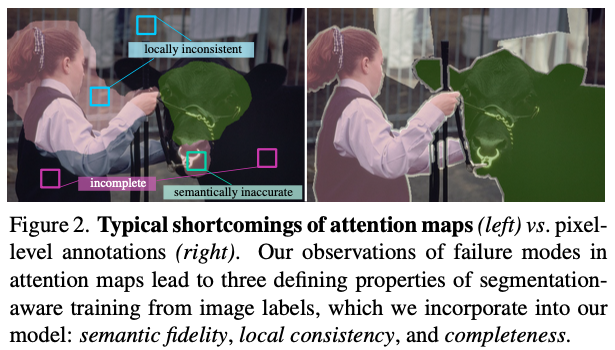
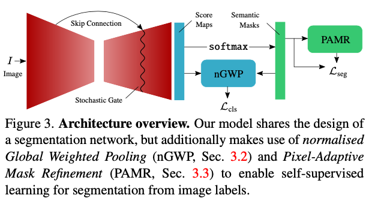
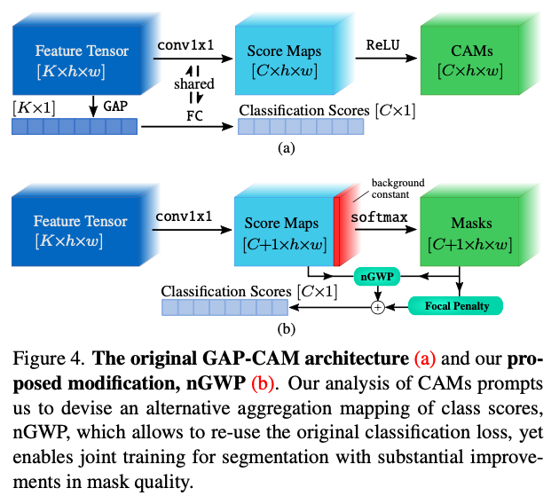

# Single-Stage Semantic Segmentation from Image Labels

## Basic Information

| 引用情報 |                                              |
| -------- | -------------------------------------------- |
| 筆者     | Nikita Arslanov, Stefan Roth                 |
| 所属     | Department of Computer Science, TU Darmstadt |
| 会議     | CVPR                                         |
| 年       | 2020                                         |
| 引用数   | -                                            |
| リンク   | https://github.com/visinf/1-stage-wseg       |

## どんなもの

Weakly-supervisedな設定、すなわち画像レベルのラベルしか用意されていない状況でのsemantic segmentationの新手法の提案。近年同様の研究は増えてきたもののmulti-stageで複雑だったと指摘し、single-stageでありながら精度が担保される手法を提案している。
筆者らはまずweakly-supervisedな設定で望ましい三つの性質

1. local-consistency
2. semantic fidelity
3. completeness

を定義した上でこれらの性質をガイドラインにしつつ画像レベルのアノテーションから自己教師あり学習でsemanticなマスクを学習することができる枠組みを考案している。

## 先行研究に比べてどこがすごい

### 背景

教師ありのSemantic Segmentationはラベルの用意が大変なため適用範囲は限定的。一方で、画像レベルのアノテーション(weakly supervised)に頼る手法はこれまでClass Activation Maps(CAM)の出力のマスクなどを利用することでそれなりの成果を出してきた。CAMの出力はそもそもsegmentationを目的にしたものではないため修正が必要であり、そのために複数のstageを重ねたり、saliencyなどの情報をさらに追加する複雑なパイプラインが必要だった。

### 新規性

筆者らの手法はsingle-stageでweakly-supervisedなラベルのみから(saliencyの推定などを使わず)セグメンテーションを行う手法である。この手法の鍵となるのはsegmentation-awareな画像分類問題の学習手法である。これまでのattention mapsにはいくつかの欠点がある。

1. semanticラベルは局所的な一貫性がない(**locally-inconsistent**)、すなわち近傍にある同じ見た目の領域が異なるクラスを割り当てられる可能性がある。
2. attention mapsは物体の全体を覆うようになっておらず**incomplete**である。
3. attention mapsの多くの部分は正しくても一部が異なるクラスにふられていることがある。

これらの観察からsemantic segmentationにおいて重要な三つの性質が定義される。

1. *local-consistency*: 近傍にある似た見た目の領域は同じラベルがふられるべきである。
2. *semantic fidelity*: segmentation maskを出力するモデルは信頼性の高い分類判断ができるsegmentation maskを出力する必要がある。
3. *completeness*: モデルの出力は画像中の全ての視認可能なクラス出現を特定する必要がある。すなわち既知のクラスが視認可能であればその領域には必ずそのクラスのラベルをつける必要がある。

分類問題は十分なエビデンスさえあれば良いので、CAMでは*completeness*も*local consistency*も保証されない。

これらの性質を参考に筆者らはCAMを大幅に上回る以下のアプローチをデザインしている。

1. *normalized Global Weighted Pooling*: segmentation taskへの学習も兼ねる分類スコアの計算法
2. *Pixel-Adaptive Mask Refinement*: segmentation maskの見かけをよくする手法。これにより修正されたマスクを擬似的なground truthとしてself-supervised trainingを行う。
3. *Stochastic Gate*: self-supervisedな手法で問題となりやすい、擬似マスクの誤りに対応するため、様々なサイズの局所受容野の特徴を混ぜ合わせる

## 技術や手法のキモはどこ

モデル構造は通常のsegmentation-basedなネットワークアーキテクチャと大きな差はなく推論時はforwardを一回行えば良い。一方学習時は自己教師あり学習の要領で画像レベルのラベルのみから学習が行われる。

前項であげた三つの特色がそれぞれ図に示されている。

1. nGWP(normalized Global Weighted Pooling)はセグメンテーションのマスクを分類判別に用いるための集約関数であり、*semantic fidelity*を実現するために重要である。これは**ピクセルごとのconfidenceを用いてそれぞれの分類スコアに相対的な重み付けをする**ものである。また、*completeness*の実現のために分類スコアに対して**focal mask penalty**というものを適用している。
2. *local-consistency*の実現のためにPAMR(Pixel-Adaptive Mask Refinement)を用いている。これは粗いsegmentation maskを見かけ上の手がかりを元に修正するものである。修正されたマスクは擬似的なground truthラベルとして分類の学習と同時に行われるsegmentationの学習に用いられる。
3. PAMRで修正されたラベルはまだ誤りを含む可能性があり学習に影響が出かねないのでSG(Stochastic Gate)により、表現力は高いが誤りが起きやすい*深い*特徴と表現力は低いが誤りを起こしづらい*浅い*特徴を確率的に組み合わせることで対応する。

### CAMs

を特徴マップの`K`個のチャンネルの`k`番目であるとする。またはクラス`c`に対する全結合層での重みであるとする。すると、GAP -> 全結合層を挟んで特徴マップから算出されるクラスのスコアは

となる。ただし`h, w`は画像の縦横のサイズである。クラス`c`に対するClass Activation Mapping(CAM)は次のように計算される。

これは特徴マップ中の小領域における予測を覆い隠してしまう可能性があるためセグメンテーションのマスク予測には不適である。また、CAM-GAPを用いることは以下のような問題点がある。

1. CAMのマスク値は制限がなされていない(`0-1`の範囲におさまる、といった制約がない)一方、セグメンテーションのマスク値は正規化する必要がある。
2. GAPを用いると各ピクセル値に割り当てられるクラスラベルは一つだけである、といったセグメンテーションにおける仮定を反映していない。

### nGWP

normalized Global Weighted Poolingではまず特徴マップからピクセルごとの各クラスの分類スコアを算出する。その上でセグメンテーションと同様に背景を表現するチャンネルを一つ足してピクセルごとの`softmax`をとって信頼度つきのマスクを得る。分類スコアを計算するために以下の式で定義される*normalized Global Weighted Pooling*を適用する。

これにより小さな領域のクラスも拾うことができるようになる一方で、領域のサイズにスコアがよらないようになっているためrecallがGAPより低くなってしまう可能性がある。これを防ぐため正解クラスのマスクのサイズを大きくするような以下の損失をかける。

これによりマスクが0に近いときのみ大きな負の値がつくため、マスクを大きくするような効果が得られる。また、分類の難易度に応じた損失設計も可能であり、この損失項を一般化してfocal lossをかけることとした。

最終的な出力はとし、これに対しmulti-label soft margin lossを分類問題の損失として適用した。

### Pixel-Adaptive Mask Refinement

分類のロス設計によって*semantic fidelity*と*completeness*については対応ができるが、*local consistency*についてはできていないのでmaskの修正を行う必要がある。local consistencyは近傍にある似た見た目の領域は同じラベルがふられるべきであるという制約である。

## どうやって有効だと検証した

## 議論はある

## 次に読むべき論文は
